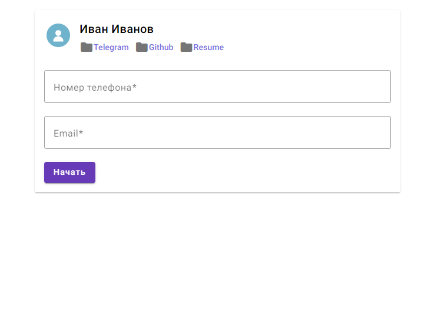
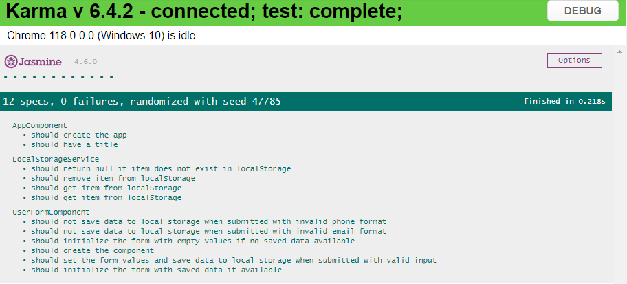

# Тестовое задание  Validation Form

Ссылка на [задание](https://docs.google.com/document/d/16GeeDzWbqq659jtpFzPTZ5ifVzQ3m_KarcSsKI11VbA/mobilebasic)

**Посмотреть проект можно по ссылке:** https://w1llow1sp.github.io/angular-test-task/)

## О проекте:

Этот проект был сгенерирован с помощью [Angular CLI](https://github.com/angular/angular-cli) версии 16.2.9.
 
Этот проект представляет собой простую веб-страницу, где реализована форма проверки номера телефона и email-a.
 
Компоненты реализованы через  UI библиотеку [ Material Angular](https://material.angular.io/)
 
В случае успешной валидации -- данные сохраняются в localStorage и при обновлении страницы не теряются.

# Запуск

1. Склонируйте репозиторий
   `https://github.com/w1llow1sp/angular-test-task`
2. Установите зависимости 
   Перейдите в каталог проекта и установите все необходимые зависимости с помощью npm install
   `cd <project-name>` 
   `npm install`
3. Запустите приложение 
   Теперь вы можете запустить приложение с помощью Angular CLI. Используйте команду:
   ` ng serve`  
После этого вы можете открыть приложение в браузере по адресу [http://localhost:4200/](http://localhost:4200/).

***Приложение оттестировано*** 

